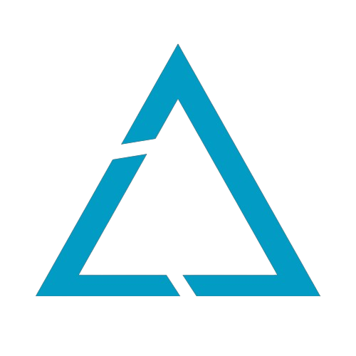

# Em desenvolvimento.....
<h1 align="center">
  </h1>

<h4 align="center"><a href="https://praticode.com">Clique para visitar o projeto</a></h4>

## 📚 Seções

O site é composto por cinco seções:

- **Home:** Nele temos alguns anuncios de produtos;
- **Projects:** Nessa seção temos os projetos desenvolvidos por mim;
- **About:** Apresenta quem sou eu e um pouco da trajetoria;
- **Contact:** Nessa seção contem as formas de como me contactar;

## 📂Tecnologias utilizadas

Para o desenvolvimento deste portifolio utilizei as seguintes tecnologias:

- HTML;
- CSS;
- React;
- Javascript;
- SVG.

## 🌐 Softwares utilizados no desenvolvimento
Para desenvolvimento deste site utilizamos algumas plataformas que nos auxiliaram nos conceitos de desing:

- https://www.canva.com;
- https://getbootstrap.com;
- https://www.w3schools.com;
- https://react-bootstrap.com;
- https://uiverse.io.com
  
<h2>Dev</h2>

<table>
  <tr>
    <td align="center">
      <a href="https://github.com/Kevenferraz39">
           
        
          <b>Keven Ferraz</b>
        
      </a>
    </td>
  </tr>
</table>
